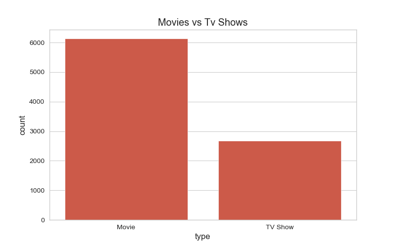
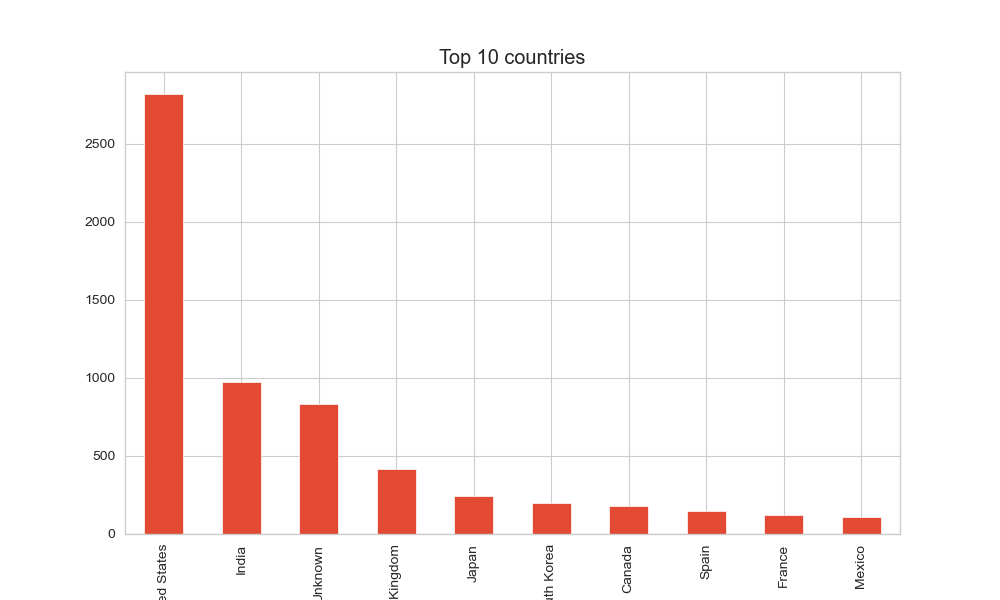
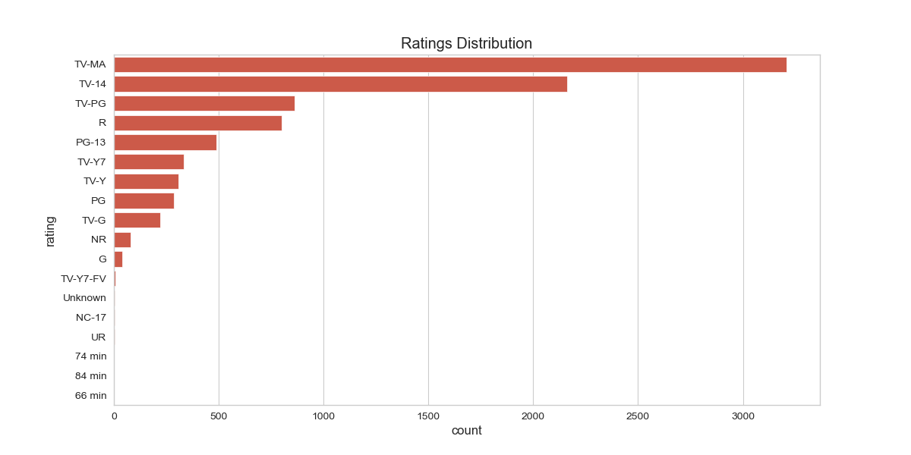
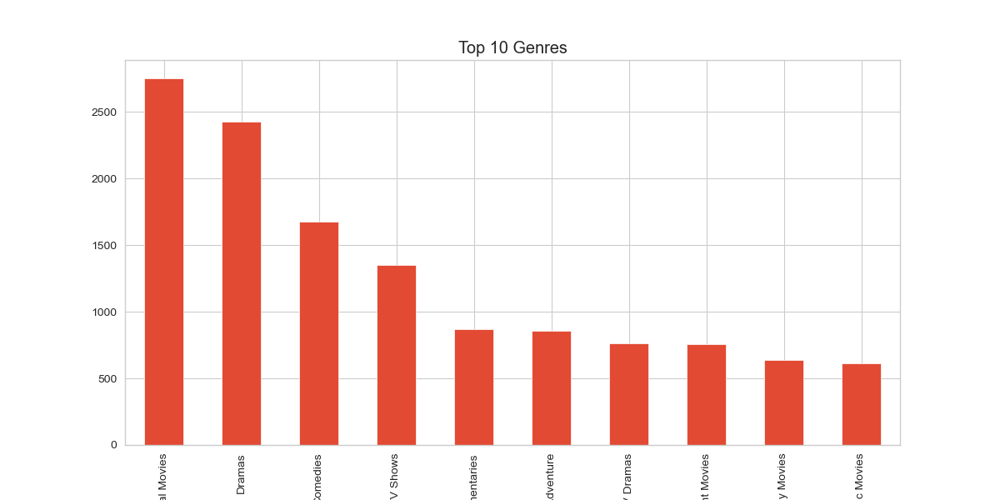
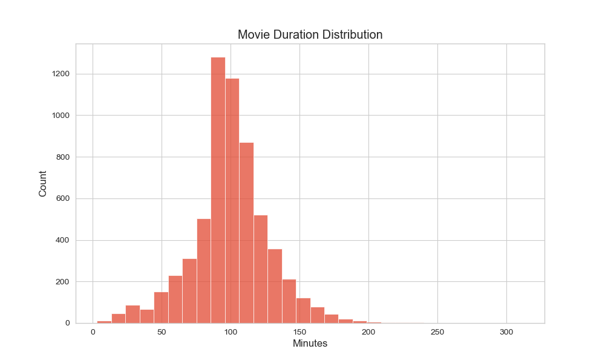

# Netflix Data Analysis Dashboard

## Project Overview

This project performs Exploratory Data Analysis (EDA) on the Netflix Titles dataset using Python.

## Technologies Used

- Python
- Pandas
- NumPy
- Matplotlib
- Seaborn
- Jupyter Notebook

## Analysis Performed

- Movies vs TV Shows
- Top 10 Countries
- Content Added Over Years
- Ratings Distribution
- Top Genres
- Movie Duration Analysis

## Key Insights

- Movies significantly outnumber TV Shows.
- The United States contributes the largest amount of content.
- Content additions peaked between 2016 and 2020.
- TV-MA and TV-14 are the most common ratings.
- International Movies and Dramas dominate the catalog.
- Most movies are between 80 and 120 minutes long.

## Visualizations

### Movies vs TV Shows

### Top Countries

### Content Added Over Years

### Ratings Distribution

### Top Genres

### Movie Duration Distribution
